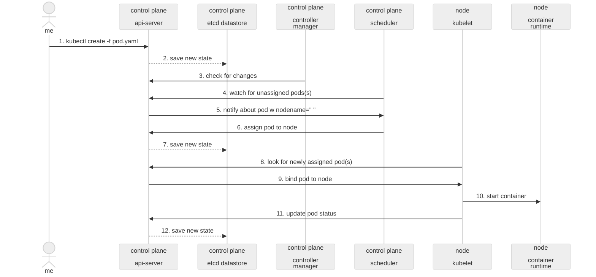

# Kubernetes and Cloud Native Security Associate (KCSA) Study Guide

https://training.linuxfoundation.org/certification/kubernetes-and-cloud-native-security-associate-kcsa/

## Domains

```
**Overview of Cloud Native Security 14%**

    The 4Cs of Cloud Native Security ✔️
    Cloud Provider and Infrastructure Security ✔️
    Controls and Frameworks ✔️
    Isolation Techniques ✔️
    Artifact Repository and Image Security ✔️
    Workload and Application Code Security ✔️

**Kubernetes Cluster Component Security 22%**

    API Server ✔️
    Controller Manager ✔️
    Scheduler ✔️ 
    Kubelet ✔️
    Container Runtime
    KubeProxy
    Pod
    Etcd
    Container Networking
    Client Security
    Storage

**Kubernetes Security Fundamentals 22%**

    Pod Security Standards
    Pod Security Admissions
    Authentication
    Authorization
    Secrets
    Isolation and Segmentation
    Audit Logging
    Network Policy

**Kubernetes Threat Model 16%**

    Kubernetes Trust Boundaries and Data Flow
    Persistence
    Denial of Service
    Malicious Code Execution and Compromised Applications in Containers
    Attacker on the Network
    Access to Sensitive Data
    Privilege Escalation

**Platform Security 16%**

    Supply Chain Security
    Image Repository
    Observability
    Service Mesh
    PKI
    Connectivity
    Admission Control

**Compliance and Security Frameworks 10%**

    Compliance Frameworks
    Threat Modelling Frameworks
    Supply Chain Compliance
    Automation and Tooling
```


source: https://kubernetes.io/images/docs/components-of-kubernetes.svg

## Overview of Cloud Native Security 14% 🕵🏻‍♂️
### The 4Cs of Cloud Native Security
Cloud > Cluster > Container > Code

- **Cloud**
    - API server
      - Ensure internal-only traffic 
      - Use Network ACLs or NSGs to restrict access
      - Ensure internal-only traffic
        
    - Nodes
      - Restrict traffic to nodes from the control plane via specified ports using ACLs
      - Allow access only for NodePort and LoadBalancer services
      - No direct node exposure to the Internet
        
    - Cloud provider API (Allows AKS clusters to provision Azure Load Balancers, Disks, etc.)
      - Apply Least Privilege Principle for IAM roles, service principals, or credentials
      - Restrict access to the cloud provider API to necessary users and services
        
    - etcd
      - Access limited to the control plane only
      - Enforce TLS
      - Enforce Encryption at rest (CSI Drivers for external vaults)
        
- **Cluster**
    1. **Securing Cluster Components**
        - Use private clusters 
        - Enforce (m)TLS
        - Apply Network Policies for pod-to-pod and pod-to-external traffic
        - Enforce API AuthN (e.g., OIDC) (Rotate and expire service account tokens)
        - **API AuthZ RBAC**
            - **RBAC Authorisation**
              - Roles and ClusterRoles
              - RoleBindings and ClusterRoleBindings
              - Principle of Least Privilege for all users, service accounts, and system components
                
            - **Node Authorisation**
              - Kubelets can only access their own Node object
              - Kubelets can only access Pods bound to their node
                
            - **Node Restrictions (Admission Controller)**
              - Enforces additional validation rules beyond authN and authZ (RBAC)
              - Second layer of validation applied after RBAC authorization (kube native)
              - E.g., Limits the scope of actions kubelets can perform to their own Node object or Pods bound to their node
                
    2. **Securing Apps**
      - Limit the use of hostPath volumes
      - Use Pod Security Policies (PSP) or its replacement (e.g., Kyverno or OPA/Gatekeeper)
      - Configure resource requests and limits to avoid resource exhaustion
      - Scan for vulnerabilities within code
        
- **Container**
  - Use trusted container registries
  - Image signing and enforcment (e.g., via OPA Gatekeeper)
  - Scan container images for vulnerabilities
  - Minimal base images (e.g., distroless or Alpine)
  - Runtime - Detec anomalies e.g., via Falco
  - Runtime - Avoid running containers as root & non-privileged mode & read-only filesystem, etc.
  - Runtime - Limit container capabilities (e.g., avoid CAP_SYS_ADMIN)

- **Code**
  - Use Static Application Security Testing (SAST) tools
      - Use tools like Dependabot or Snyk to monitor vulnerabilities in dependencies
      - Store secrets securely using encrypted etcd or external vaults via CSI driver

### Cloud Provider and Infrastructure Security
- IAM & MFA & least privileges, vaults
- Private clusters, network segmentation
- Encryption TLS + at rest for sensitive data
- Compliance & governance & monitoring

### Controls and Frameworks
- NIST - Controls with the five pillars: Identify, Protect, Detect, Respond, and Recover
- CIS - Hardening guides
- HIPPA - Health Insurance Portability and Accountability Act
- PCI DSS - Payment Card Industry Data Security Standard
- GDPR - General Data Protection Regulation
- Tools to Implement and Validate Controls
- Infrastructure-as-Code (IaC) Scanning
- AWS Security Hub, Azure Defender
- Policy Enforcement: OPA (Open Policy Agent), Kyverno, or Gatekeeper

 ### Isolation Techniques

1. **Namespace Isolation**
   - Use namespaces to logically separate workloads
   - Enforce RBAC rules scoped to namespaces
    
2. **Network Isolation**
   - Use Network Policies to restrict pod-to-pod and pod-to-external communication
   - Isolate clusters with VPCs or subnets
   - Configure firewalls or Network Security Groups to restrict traffic
    
3. **Node Isolation**
   - Schedule sensitive workloads on dedicated nodes.
   - Deploy system-critical pods (e.g., kube-system) separately from application workloads
   - Harden nodes by disabling unused ports and services & PSP & Kernal hardening tools
    
4. **Storage Isolation**
   - Use volume policies to ensure data is mounted securely (e.g., read-only when possible)
   - Isolate Persistent Volume Claims (PVCs) Like Storage Account
   - Encrypt storage using cloud provider tools or Kubernetes CSI
    
5. **Workload Isolation**
   - Use PSP (e.g., baseline, restricted).
   - Prevent privilege escalation (allowPrivilegeEscalation: false).
   - Run containers as non-root users.
    
6. **API Access Isolation**
   - Restrict API server access using network controls
   - Configure RBAC to limit API access per user or service account
   - Disable anonymous and unauthenticated access
    
7. **Multi-Tenancy**
   - Use unique namespaces, Network Policies, and quotas for tenants.
   - Use workload identity or separate IAM roles for each tenant.
   - Enforce pod-level security boundaries with sandboxing (e.g., gVisor, Kata).

### Artifact Repository and Image Security
1. Artifact Repository
   - Use private repositories with access controls.
   - Enable image signing (e.g., Cosign).
   - Automate vulnerability scans for stored images.
   - Enforce retention policies and encrypt storage.
    
2. Image Security
   - Use minimal, updated base images.
   - Avoid sensitive data in images.
   - Set USER non-root in Dockerfiles.
    
3. CI/CD & Deployment
   - Scan images in CI/CD pipelines.
   - Enforce signed and trusted images in production.
   - Use admission controllers to validate image policies.

### Workload and Application Code Security
1. Workload Security
   - Use Pod Security Standards (e.g., restricted profile).
   - Enforce resource limits (CPU and memory) for containers.
   - Set ```allowPrivilegeEscalation=false``` and ```runAsNonRoot=true```.
   - Isolate sensitive workloads using namespaces and node taints.
    
2. Application Code Security
   - Perform regular static and dynamic code analysis.
   - Avoid hardcoding secrets; use secret management tools like vaults
   - Validate all input and sanitize user data.
   - Use secure coding practices (e.g., OWASP Top 10).
    
3. CI/CD & Deployment
   - Scan dependencies for vulnerabilities (e.g., Snyk, Dependabot).
   - Automate security tests in CI/CD pipelines.
   - Enforce only validated code and dependencies in production.
 
  
## Kubernetes Cluster Component Security 22% 🎳

Here is an example illustrating the system flow starting with a kubectl apply command and ending with container startup on the node:



### API Server
The Kubernetes API Server is the control plane’s front end, handling REST requests for cluster resources (pods, nodes, services, etc.) and maintaining the cluster’s state.

1. Access Controls
   - Enable RBAC and restrict user permissions.
   - Use authentication mechanisms (e.g., certificates, OIDC).
   - Disable anonymous and unauthenticated access.

2. Network Security
   - Restrict API server access using firewalls or private endpoints.
   - Enforce HTTPS (TLS 1.2 or higher) for all connections.
   - Limit CIDR ranges allowed to access the API server.

3. Configuration Hardening
   - Enable audit logging for all API requests.
   - Use `--secure-port` and disable `--insecure-port`.
   - Set `--profiling=false` and `--enable-admission-plugins` with security-focused plugins (e.g., `PodSecurity`).

4. Monitoring and Threat Detection
   - Monitor API server logs for anomalies.
   - Use tools like Falco to detect unauthorized API usage.
   - Rotate and revoke compromised certificates immediately.

### Controller Manager
The Controller Manager runs control loops that reconcile the cluster’s desired state with its actual state (e.g., scaling replicas, managing nodes). Several controllers are bundled within the kube-controller-manager, each responsible for a specific aspect of cluster management: Replication Controller, Endpoints Controller, Node Controller, etc.

1.	Access Controls
    - Use certificates to authenticate the Controller Manager to the API Server.
    - Limit access to the Kubernetes API server with RBAC roles tailored to the controllers.
    - Disable unnecessary controllers using the ```--controllers``` flag.
     
2.	Network Security
    - Run the Controller Manager on secure, internal networks or private nodes.
    - Enforce HTTPS for communication between controllers and the API server.
    - Restrict access to the Controller Manager process using firewalls.
     
3. Configuration Hardening
    - Set ```--use-service-account-credentials=true``` to avoid using root credentials.
    - Limit the Controller Manager’s namespace-scoped operations with appropriate permissions.
    - Configure ```--profiling=false``` to disable profiling endpoints.
    - Enable leader election ```(--leader-elect=true)``` for high availability and to avoid split-brain scenarios.
     
4.	Monitoring and Threat Detection
    - Enable and monitor Controller Manager logs for anomalies.
    - Track resource reconciliation events to identify potential misconfigurations.
    - Audit API calls made by the Controller Manager using API server logs.

### Scheduler
The Kubernetes Scheduler selects the most appropriate node for pod placement based on resource availability and constraints.

1. Access Controls
    - Use certificates for API server authentication.
    - Limit RBAC permissions to scheduling functions.
      
2.	Network Security
    - Restrict Scheduler to private networks and enforce HTTPS.
      
3.	Configuration
    - Use secure kubeconfig with ```--kubeconfig```.
    - Enable leader election ```(--leader-elect=true)```.
    - Disable profiling ```(--profiling=false)```.
      
4.	Monitoring
    - Audit Scheduler logs and pod placement patterns.
  
### Kubelet
The Kubelet runs on each node, ensuring containers are running in pods as specified by the API Server.

1.	Access Controls
    - Require client certificates for API server communication.
    - Disable anonymous access and limit node RBAC roles.

2.	Network Security
    - Restrict Kubelet API access with firewalls and private IPs.

3.	Configuration
    - Enable authentication and authorization ```(--authentication-token-webhook=true)```.
    - Disable insecure ports ```(--port=0)```.
    - Enforce pod security standards using admission hooks.

4.	Monitoring
    - Monitor Kubelet logs for unauthorized requests.


## Kubernetes Threat Model


[Tutorial: Attacking and Defending Kube... Brad Geesaman, Jimmy Mesta, Tabitha Sable & Peter Benjamin](https://www.youtube.com/watch?v=UdMFTdeAL1s)

  - https://securekubernetes.com/scenario_1_attack/

[Bad Bods](https://github.com/BishopFox/badPods/tree/main)
