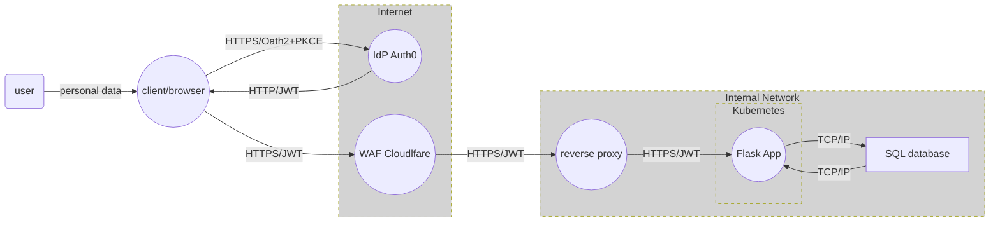

```mermaid
flowchart LR
    user(user)
    client((client/browser))
    idp((IdP Auth0))
    waf((WAF Cloudlfare))
    proxy((reverse proxy))
    api((Flask App))
    db[|borders:tb|SQL database]
    user--personal data-->client
    client--HTTPS/Oath2+PKCE-->idp
    idp--HTTP/JWT-->client
    client--HTTPS/JWT-->waf
    subgraph external [Internet]
        waf
        idp
    end
    subgraph internal [Internal Network]
        waf--HTTPS/JWT-->proxy
        proxy--HTTPS/JWT-->api
        subgraph k8s [Kubernetes]
            api
        end
        db--TCP/IP-->api
        api--TCP/IP-->db
    end
    classDef boundary fill:lightgrey,stroke-dasharray: 5 5
    external:::boundary
    internal:::boundary
    k8s:::boundary
    
```
