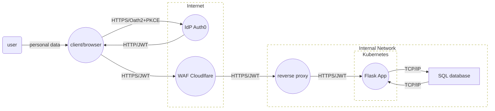

# Example Mermaid Threat Model
## Simple Mermaid Threat Model for Web Apps with IdP, WAF, API, and DB

This threat model should serve as a starting point for any security review for applications using Identity Provider (IdP) authentication, Web Application Firewall (WAF), an API backend, and a database. It ensures secure authentication, protected API communications, and controlled data access. This model serves as a starting point for designing similar architectures.

🛠 Architecture Overview
- User → Client (Browser): End-user interacts with the frontend application.
- Client → IdP (Auth0): OAuth2 with PKCE secures authentication.
- Client → WAF (Cloudflare): Protects against common web threats.
- WAF → Reverse Proxy: Handles API traffic filtering.
- Reverse Proxy → API (Flask): Processes business logic and connects to the database.
- API → Database (SQL): Stores and retrieves application data.

## Tools Used
- [SimpleMermaid.com](https://SimpleMermaid.com)
- [ThreatBandit.com](https://ThreatBandit.com)

## Mermaid Diagram

## Next Steps
- Think of logging
- Think of weak OAuth2 flows
- Think of input validations and parameterized queries
- Think of rate-limitting 
- Think of kubernetes infra threats
- TLS 1.2 or 1.3 everywhere
- Think of least privilege access for API to DB interactions
- And many many more... 👀

